# YOLOv5 Base Model Analysis

---

## Model Summary

- **Model:** YOLOv5 Base
- **Parameters:** 20,889,303
- **Layers:** 212
- **GFLOPs:** 48.0

---

## Overall Metrics

| Metric            | Value |
| ----------------- | ----- |
| **Precision (P)** | 0.721 |
| **Recall (R)**    | 0.561 |
| **mAP@0.5**       | 0.587 |
| **mAP@0.5:0.95**  | 0.419 |

---

## Class-Wise Metrics

| Class              | Images | Instances | Precision (P) | Recall (R) | mAP@0.5 | mAP@0.5:0.95 |
| ------------------ | ------ | --------- | ------------- | ---------- | ------- | ------------ |
| **Airliner**       | 272    | 72        | 0.853         | 0.931      | 0.940   | 0.762        |
| **Boat**           | 272    | 274       | 0.795         | 0.833      | 0.880   | 0.585        |
| **Bus**            | 272    | 84        | 0.451         | 0.655      | 0.568   | 0.428        |
| **Car**            | 272    | 523       | 0.650         | 0.826      | 0.821   | 0.559        |
| **Long Vehicle**   | 272    | 91        | 0.646         | 0.640      | 0.638   | 0.443        |
| **Other**          | 272    | 70        | 1.000         | 0.000      | 0.0426  | 0.0279       |
| **Pushback Truck** | 272    | 20        | 1.000         | 0.000      | 0.0386  | 0.0227       |
| **Stair Truck**    | 272    | 39        | 0.585         | 0.538      | 0.641   | 0.397        |
| **Truck**          | 272    | 132       | 0.641         | 0.473      | 0.601   | 0.452        |
| **Van**            | 272    | 267       | 0.592         | 0.712      | 0.698   | 0.515        |

---

## Visualizations

### 2 Examples

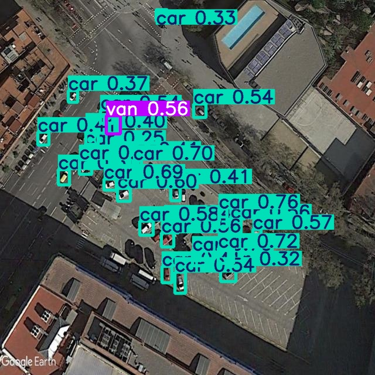

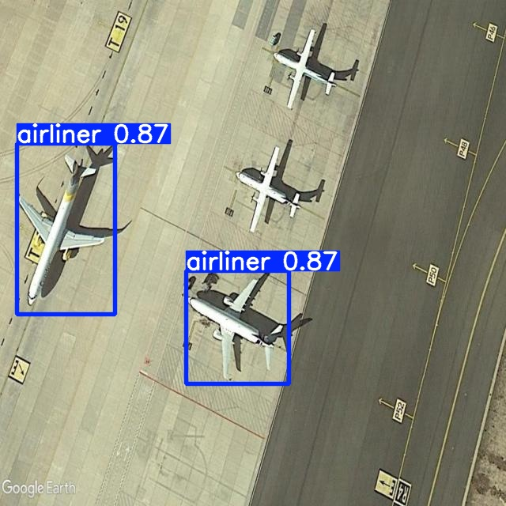

### F1-Score Confidence Curve

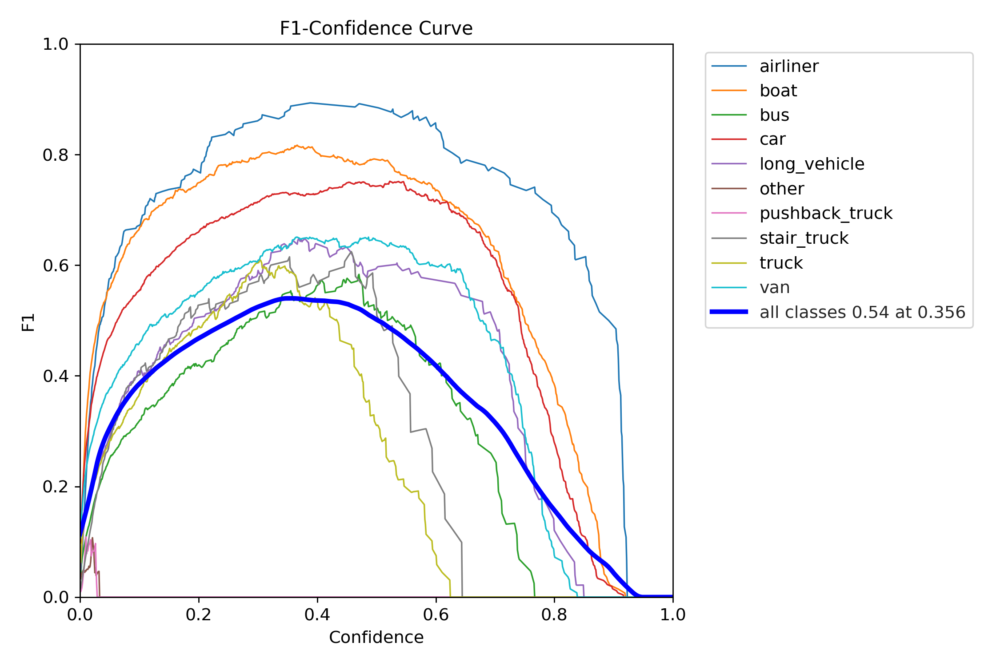

### Precision-Confidence Curve

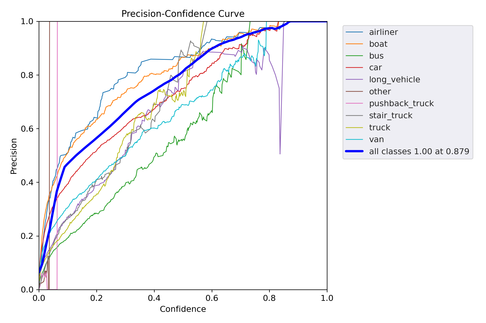

### Precision-Recall Curve

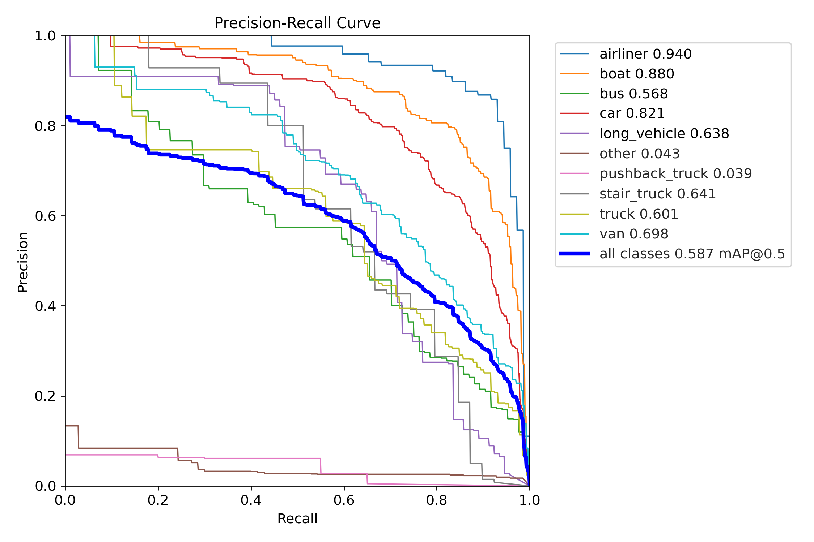

### Recall-Confidence Curve

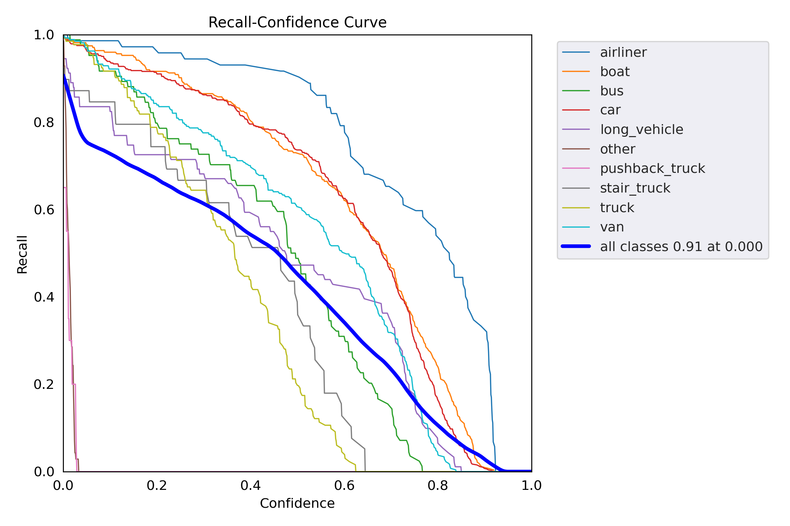

### Training and Validation Results

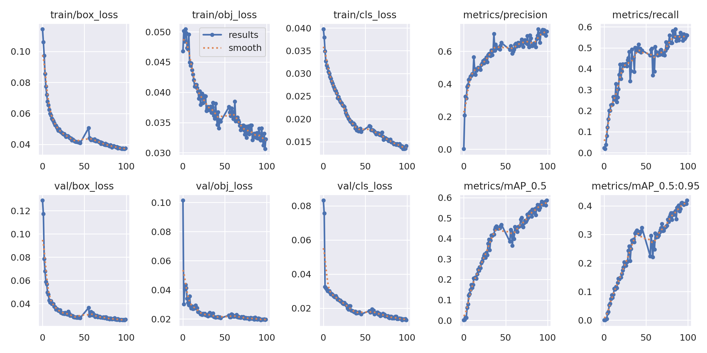

### Confusion Matrix

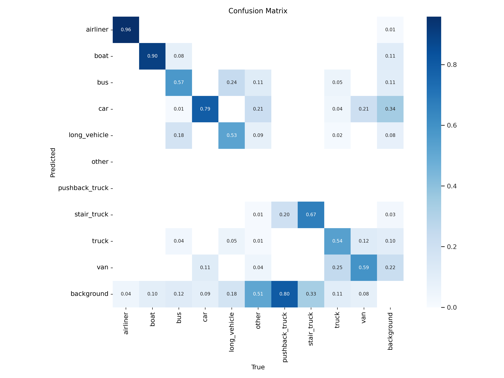

---

## Observations

### Strengths

1. **High Performance for Frequent Classes:**

   - Classes like "airliner" and "boat" achieve high precision, recall, and mAP scores, with "airliner" reaching a mAP@0.5:0.95 of 0.762.

2. **Balanced Detection for Common Classes:**
   - "Car" and "van" classes maintain balanced precision, recall, and mAP metrics, demonstrating consistent detection reliability.

### Weaknesses

1. **Poor Performance for Rare Classes:**

   - The "other" and "pushback truck" classes have zero recall and minimal mAP scores, indicating difficulty in detecting these objects.

2. **Moderate Recall:**
   - While precision is strong at 0.721, the overall recall of 0.561 shows the need for improvement in detecting all instances in the dataset.

### Insights

- The YOLOv5 base model exhibits reliable detection for frequent classes but struggles with rare or complex object classes.
- Fine-tuning the model and augmenting the dataset can address performance gaps for underrepresented classes.

---

## Recommendations

1. **Data Augmentation:**

   - Increase the number of training samples for rare classes like "other" and "pushback truck" to improve recall and mAP scores.

2. **Hyperparameter Tuning:**

   - Optimize the model's hyperparameters to improve recall and precision across all classes.

3. **Class Imbalance Handling:**
   - Implement techniques to address class imbalance, such as oversampling rare classes or applying weighted loss functions.

---

## Conclusion

The YOLOv5 base model provides robust performance for frequent object classes, making it a strong candidate for general object detection tasks. However, its limitations in detecting rare objects highlight the need for further refinement. With targeted improvements, the model can achieve better overall performance across all classes.

---

# YOLOv5 C3HB Model Analysis

---

## Model Summary

- **Model:** YOLOv5-C3HB
- **Parameters:** 44,112,519
- **Layers:** 303
- **GFLOPs:** 97.7

---

## Overall Metrics

| Metric            | Value |
| ----------------- | ----- |
| **Precision (P)** | 0.556 |
| **Recall (R)**    | 0.689 |
| **mAP@0.5**       | 0.670 |
| **mAP@0.5:0.95**  | 0.493 |

---

## Class-Wise Metrics

| Class              | Images | Instances | Precision (P) | Recall (R) | mAP@0.5 | mAP@0.5:0.95 |
| ------------------ | ------ | --------- | ------------- | ---------- | ------- | ------------ |
| **Airliner**       | 272    | 72        | 0.852         | 0.958      | 0.958   | 0.806        |
| **Boat**           | 272    | 274       | 0.808         | 0.739      | 0.854   | 0.574        |
| **Bus**            | 272    | 84        | 0.604         | 0.929      | 0.893   | 0.659        |
| **Car**            | 272    | 523       | 0.728         | 0.822      | 0.836   | 0.600        |
| **Long Vehicle**   | 272    | 91        | 0.581         | 0.747      | 0.747   | 0.556        |
| **Other**          | 272    | 70        | 0.310         | 0.214      | 0.156   | 0.111        |
| **Pushback Truck** | 272    | 20        | 0.103         | 0.100      | 0.101   | 0.072        |
| **Stair Truck**    | 272    | 39        | 0.508         | 0.769      | 0.635   | 0.387        |
| **Truck**          | 272    | 132       | 0.516         | 0.780      | 0.721   | 0.553        |
| **Van**            | 272    | 267       | 0.547         | 0.827      | 0.798   | 0.613        |

---

## Visualizations

### 2 Examples

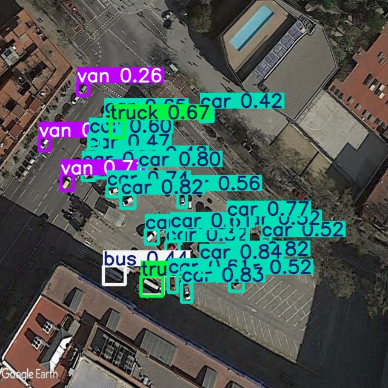

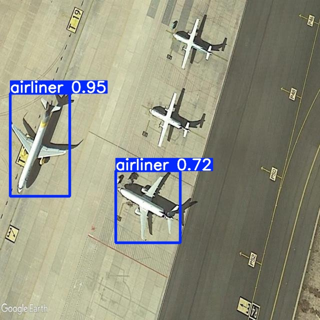

### F1-Score Confidence Curve

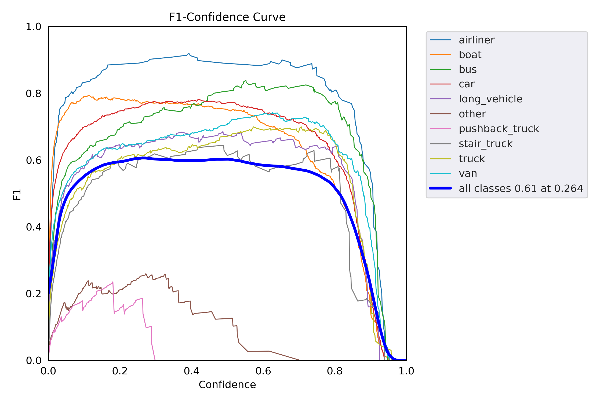

### Precision-Confidence Curve

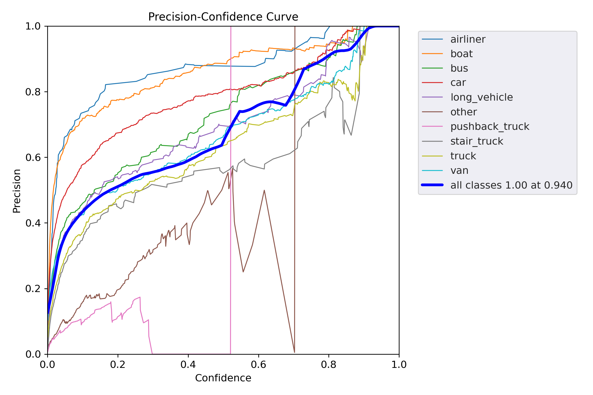

### Precision-Recall Curve

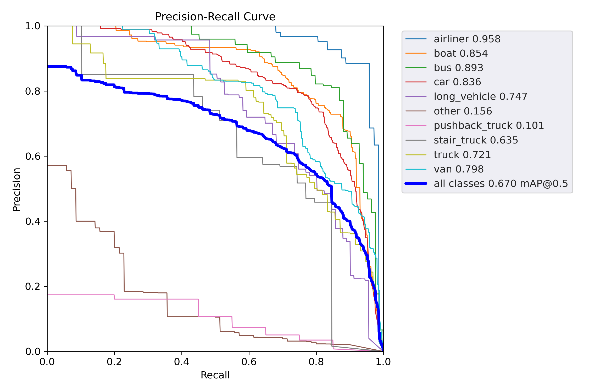

### Recall-Confidence Curve

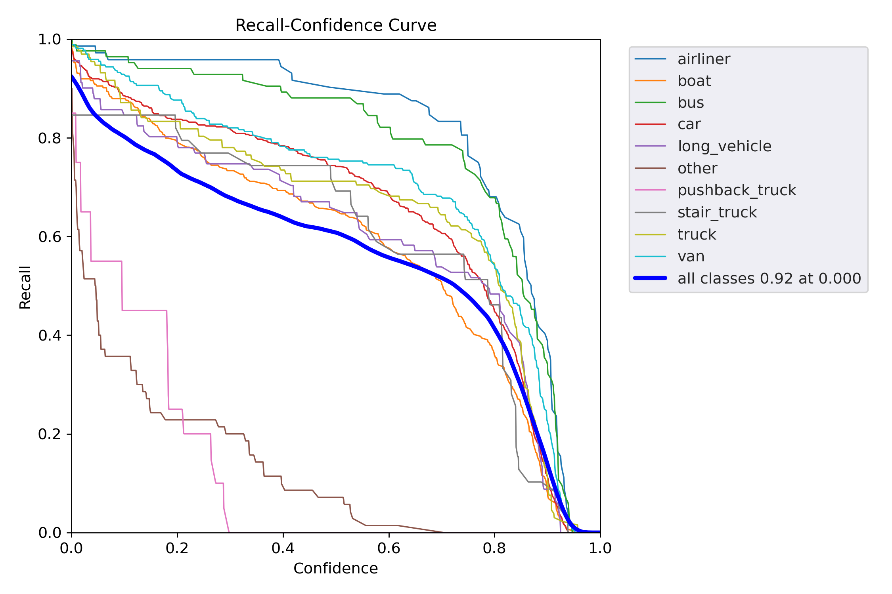

### Training and Validation Results

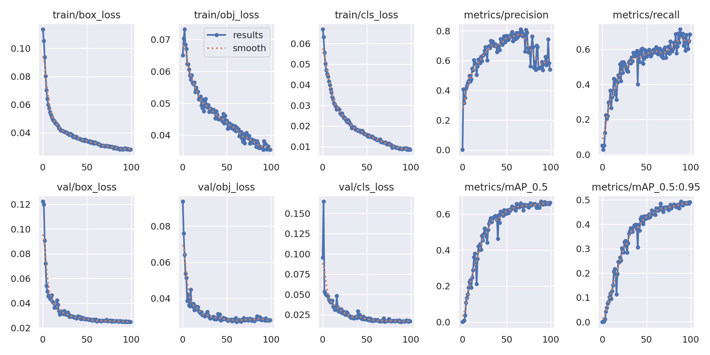

### Confusion Matrix

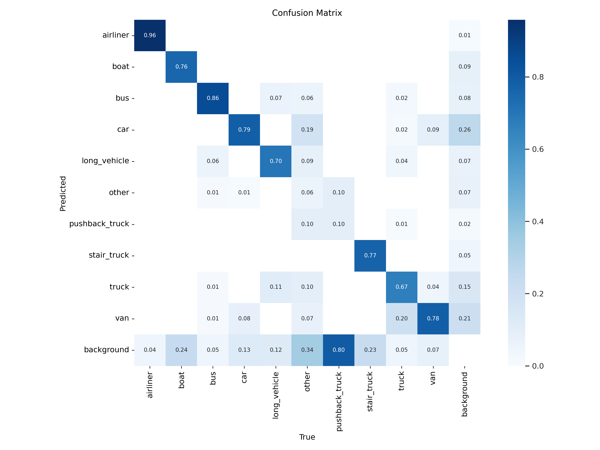

---

## Observations

### Strengths

1. **High Precision for Key Classes:**

   - Classes like "airliner" and "boat" achieve precision scores above 0.80, with mAP@0.5 values of 0.958 and 0.854, respectively.

2. **Strong Recall:**

   - The model demonstrates a high recall (0.958) for "airliner" and performs well for frequent classes like "bus" (0.929) and "car" (0.822).

3. **Consistent Performance for Common Classes:**
   - "Van" and "truck" classes maintain balanced precision and recall, with solid mAP@0.5:0.95 values.

### Weaknesses

1. **Challenges with Rare Classes:**

   - The "pushback truck" class shows low precision (0.103) and minimal mAP scores, indicating difficulty in detecting rare instances.

2. **Moderate Performance on "Other":**

   - The "other" class has a low mAP@0.5 of 0.156, highlighting challenges in detecting diverse or less frequent object types.

3. **Precision vs. Recall Trade-Off:**
   - While recall is generally high, precision drops for certain classes like "truck" (0.516) and "stair truck" (0.508).

---

## Recommendations

1. **Improve Rare Class Detection:**

   - Use oversampling or targeted data augmentation for rare classes like "pushback truck" and "other" to enhance detection accuracy.

2. **Optimize Model Parameters:**

   - Adjust hyperparameters to balance precision and recall across all classes, particularly for classes with moderate performance.

3. **Focus on Class Imbalance:**
   - Employ weighted loss functions to handle class imbalances and prioritize difficult classes during training.

---

## Conclusion

The YOLOv5-C3HB model demonstrates robust performance for frequent and visually distinct object classes, with a strong mAP@0.5 score of 0.670. However, improvements in rare class detection and a more balanced precision-recall trade-off are necessary to further enhance the model's capabilities.

---

# YOLOv7 Base Model Analysis

---

## Model Summary

- **Model:** YOLOv7 Base
- **Parameters:** 37,245,102
- **Layers:** 415
- **GFLOPs:** 105.3
- **GPU Memory Usage:** 11.5G

---

## Overall Metrics

| Metric            | Value |
| ----------------- | ----- |
| **Precision (P)** | 0.678 |
| **Recall (R)**    | 0.716 |
| **mAP@0.5**       | 0.728 |
| **mAP@0.5:0.95**  | 0.567 |

---

## Class-Wise Metrics

| Class              | Images | Instances | Precision (P) | Recall (R) | mAP@0.5 | mAP@0.5:0.95 |
| ------------------ | ------ | --------- | ------------- | ---------- | ------- | ------------ |
| **Airliner**       | 272    | 72        | 0.861         | 0.986      | 0.978   | 0.883        |
| **Boat**           | 272    | 274       | 0.862         | 0.799      | 0.885   | 0.656        |
| **Bus**            | 272    | 84        | 0.832         | 0.905      | 0.920   | 0.731        |
| **Car**            | 272    | 523       | 0.741         | 0.866      | 0.874   | 0.644        |
| **Long Vehicle**   | 272    | 91        | 0.762         | 0.774      | 0.803   | 0.649        |
| **Other**          | 272    | 70        | 0.369         | 0.300      | 0.257   | 0.178        |
| **Pushback Truck** | 272    | 20        | 0.433         | 0.200      | 0.288   | 0.209        |
| **Stair Truck**    | 272    | 39        | 0.643         | 0.739      | 0.661   | 0.396        |
| **Truck**          | 272    | 132       | 0.639         | 0.795      | 0.796   | 0.667        |
| **Van**            | 272    | 267       | 0.637         | 0.798      | 0.820   | 0.661        |

---

## Visualizations

### 2 Examples

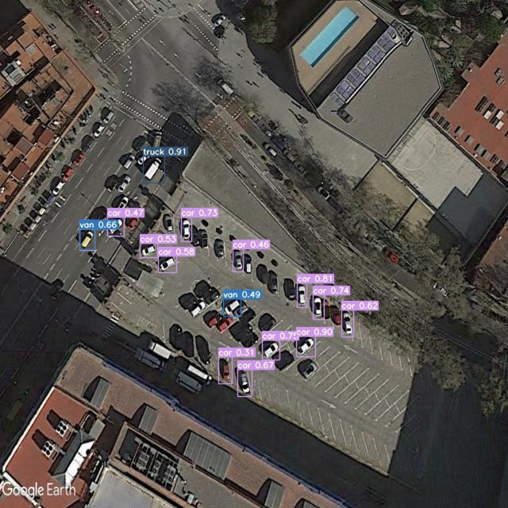

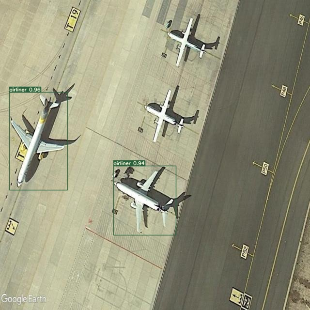

### F1-Score Confidence Curve

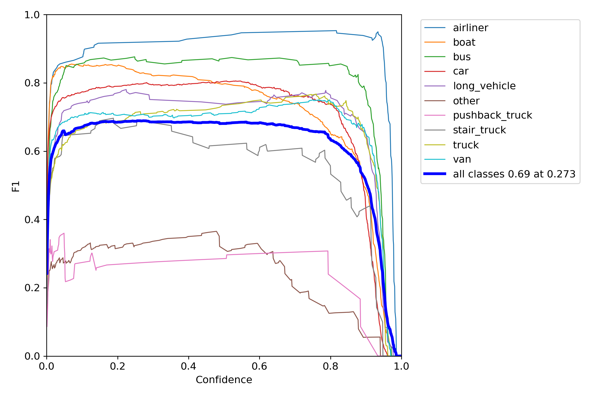

### Precision-Confidence Curve

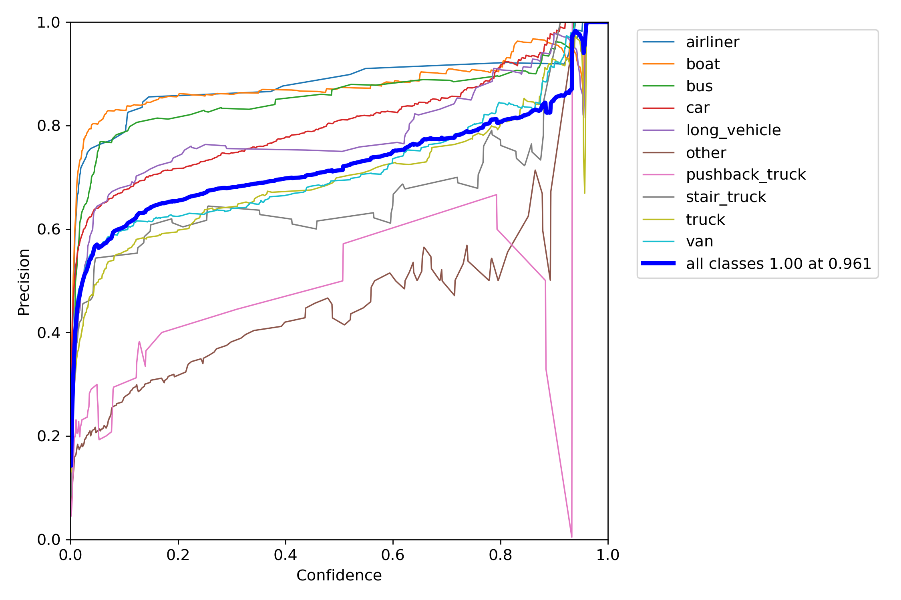

### Precision-Recall Curve

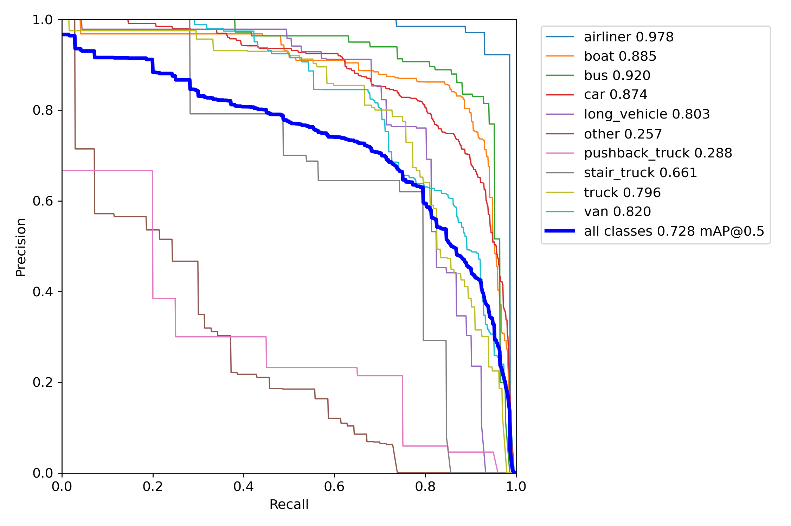

### Recall-Confidence Curve

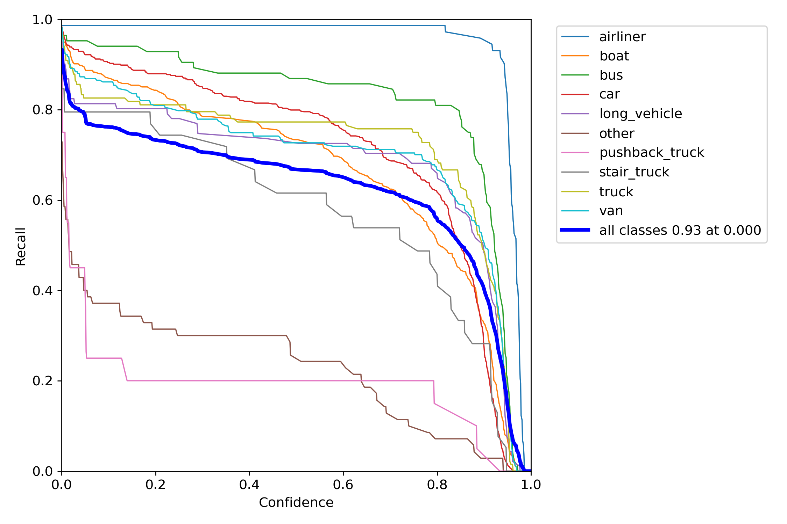

### Training and Validation Results

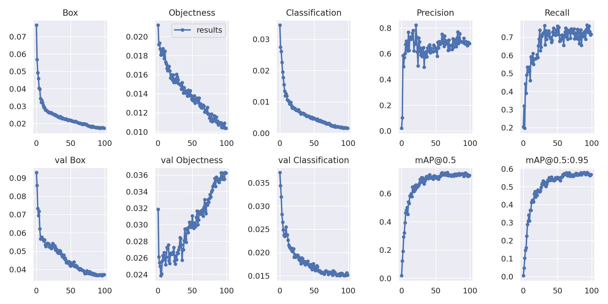

### Confusion Matrix

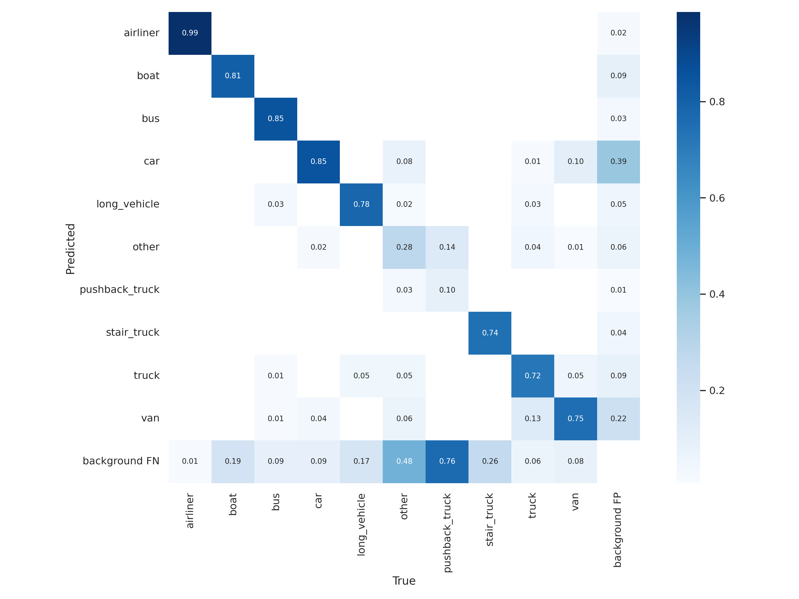

---

## Observations

### Strengths

1. **High Precision and Recall for Key Classes:**

   - The "airliner" and "bus" classes exhibit exceptional precision (0.861 and 0.832, respectively) and recall (0.986 and 0.905, respectively).
   - High mAP@0.5 scores for frequent classes like "airliner" (0.978) and "car" (0.874).

2. **Strong Class Balance:**

   - The model maintains a consistent performance for most classes, with a recall of over 0.70 for common classes like "boat" and "truck."

3. **Efficient Detection of Long Vehicles:**
   - The "long vehicle" class achieves a high mAP@0.5 (0.803) with solid precision (0.762) and recall (0.774).

### Weaknesses

1. **Challenges with Rare Classes:**

   - The "pushback truck" and "other" classes show low performance, with mAP@0.5:0.95 scores of 0.209 and 0.178, respectively.

2. **Precision-Recall Trade-Off:**
   - Rare classes such as "stair truck" and "pushback truck" exhibit suboptimal precision and recall.

---

## Recommendations

1. **Focus on Rare Classes:**

   - Augment the dataset with more samples of rare classes like "pushback truck" and "other" to improve their detection.

2. **Optimize Precision-Recall Trade-Off:**

   - Fine-tune hyperparameters to achieve a better balance between precision and recall for underperforming classes.

3. **Class-Specific Fine-Tuning:**
   - Apply class-specific optimization techniques to improve performance on rare and complex object types.

---

## Conclusion

The YOLOv7 Base model demonstrates robust performance with a high mAP@0.5 of 0.728, excelling in frequent class detection while showing room for improvement in handling rare and visually complex classes. With targeted enhancements, this model can further improve its performance across all metrics.

---

# YOLOv7-C3C2-SPPFCSPC Model Analysis

---

## Model Summary

- **Model:** YOLOv7-C3C2-SPPFCSPC
- **Parameters:** 37,245,102
- **Layers:** 412

---

## 1. Overall Metrics

| Metric            | Value |
| ----------------- | ----- |
| **Precision (P)** | 0.717 |
| **Recall (R)**    | 0.521 |
| **mAP@0.5**       | 0.580 |
| **mAP@0.5:0.95**  | 0.397 |

---

## 2. Class-Wise Metrics

| Class              | Images | Labels | Precision (P) | Recall (R) | mAP@0.5 | mAP@0.5:0.95 |
| ------------------ | ------ | ------ | ------------- | ---------- | ------- | ------------ |
| **Airliner**       | 272    | 72     | 0.782         | 0.917      | 0.928   | 0.757        |
| **Boat**           | 272    | 274    | 0.862         | 0.595      | 0.844   | 0.520        |
| **Bus**            | 272    | 84     | 0.554         | 0.893      | 0.834   | 0.608        |
| **Car**            | 272    | 523    | 0.584         | 0.822      | 0.724   | 0.462        |
| **Long Vehicle**   | 272    | 91     | 0.803         | 0.582      | 0.722   | 0.489        |
| **Other**          | 272    | 70     | 1.000         | 0.000      | 0.050   | 0.032        |
| **Pushback Truck** | 272    | 20     | 1.000         | 0.000      | 0.064   | 0.037        |
| **Stair Truck**    | 272    | 39     | 0.387         | 0.513      | 0.465   | 0.236        |
| **Truck**          | 272    | 132    | 0.603         | 0.242      | 0.466   | 0.330        |
| **Van**            | 272    | 267    | 0.598         | 0.648      | 0.697   | 0.502        |

---

## Visualizations

### 2 Examples

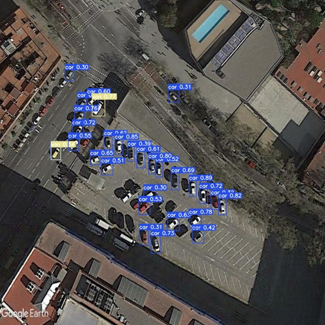

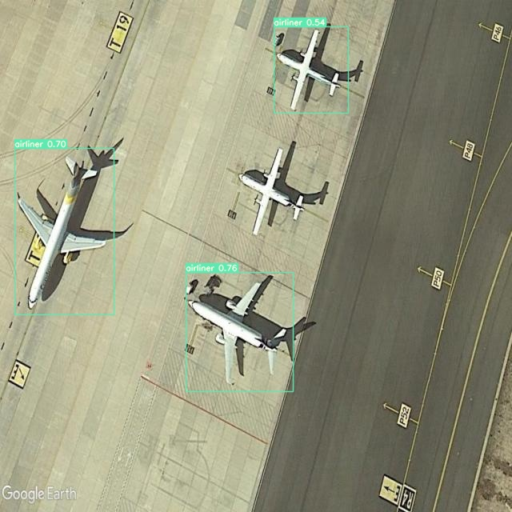

### F1-Score Confidence Curve

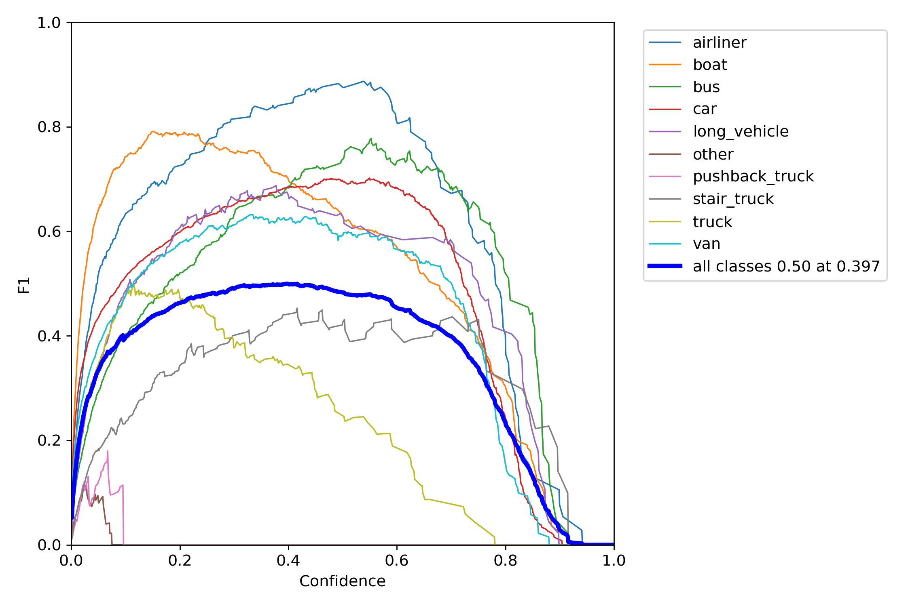

### Precision-Confidence Curve

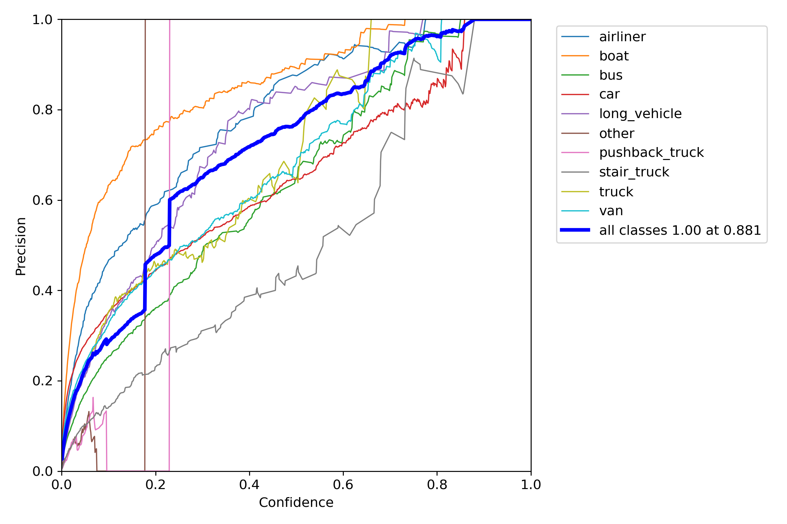

### Precision-Recall Curve

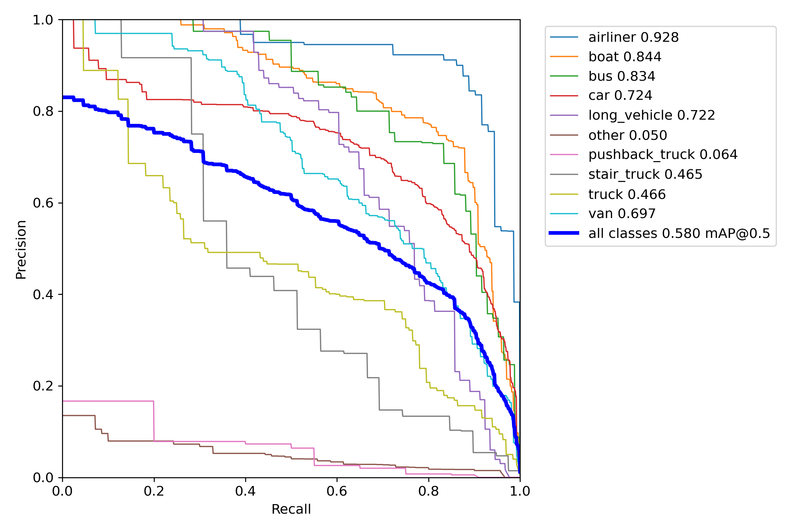

### Recall-Confidence Curve

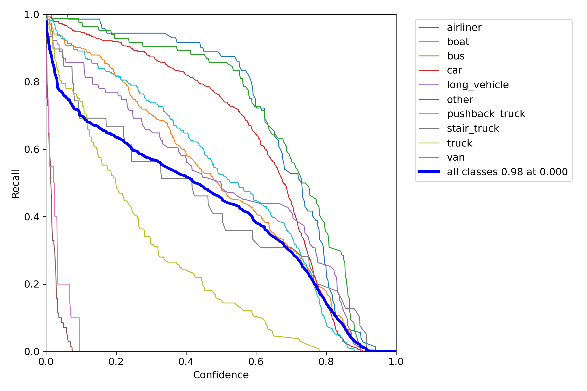

### Training and Validation Results

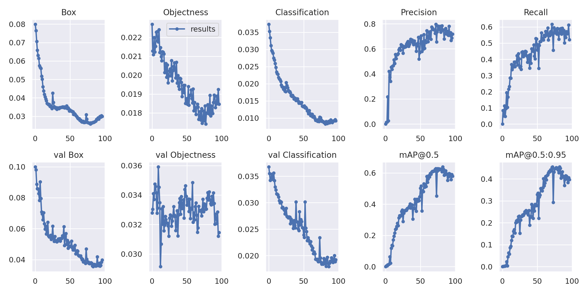

### Confusion Matrix

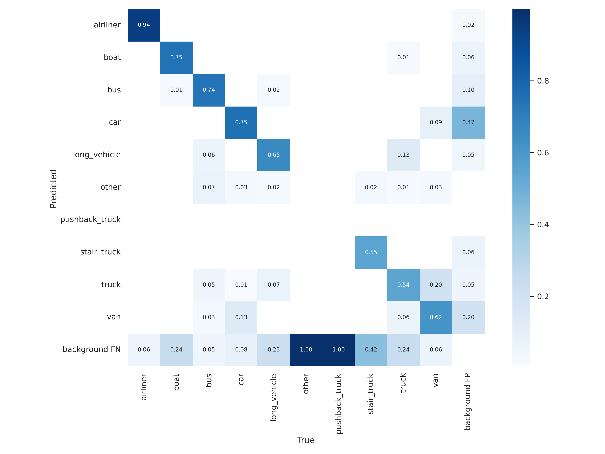

---

## Observations

### Strengths

1. **High Precision:** The model shows excellent precision for "other" and "pushback truck" categories, indicating minimal false positives.
2. **Frequent Class Performance:** Classes such as "airliner," "boat," and "bus" achieve high precision and recall values, with corresponding mAP values above 0.8 for mAP@0.5.

### Weaknesses

1. **Rare Class Detection:** Categories like "other" and "pushback truck" have a recall value of 0.0, indicating missed detections for these classes.
2. **Low Recall for Trucks:** The "truck" class demonstrates poor recall (0.242), highlighting significant missed detections despite a moderate precision value.

### Insights

- The **mAP@0.5** metric of 0.580 indicates reasonable detection capability, but the **mAP@0.5:0.95** score of 0.397 suggests performance drops at higher IoU thresholds.
- The model performs better for frequent objects like "boat," "airliner," and "car" but struggles with rare or visually challenging categories.

---

## Recommendations

1. **Dataset Augmentation:** Increase the representation of rare classes like "other" and "pushback truck" to improve recall.
2. **Fine-Tuning:** Adjust the loss function or introduce class-specific penalties to enhance the model's sensitivity to underperforming categories.
3. **Hyperparameter Optimization:** Experiment with confidence thresholds, learning rates, and anchor box adjustments to improve overall performance.

---

## Conclusion

The YOLOv7-C3C2-SPPFCSPC model demonstrates robust performance for frequent classes in the dataset. While precision remains high across most categories, recall values for certain rare classes indicate room for improvement. Future iterations should focus on improving recall and balancing performance across all object categories.

---

# YOLOv7-Transformer-HorNet-Attention Model Analysis

---

## Model Summary

- **Model:** YOLOv7-Transformer-HorNet-Attention
- **Parameters:** 34,310,654
- **Layers:** 403
- **Gradients:** 34,310,654
- **GFLOPs:** 40.9
- **GPU Memory Usage:** 13.6G

---

## Overall Metrics

| Metric            | Value |
| ----------------- | ----- |
| **Precision (P)** | 0.729 |
| **Recall (R)**    | 0.547 |
| **mAP@0.5**       | 0.565 |
| **mAP@0.5:0.95**  | 0.381 |

---

## Class-Wise Metrics

| Class              | Images | Instances | Precision (P) | Recall (R) | mAP@0.5 | mAP@0.5:0.95 |
| ------------------ | ------ | --------- | ------------- | ---------- | ------- | ------------ |
| **Airliner**       | 272    | 72        | 0.809         | 0.931      | 0.928   | 0.737        |
| **Boat**           | 272    | 274       | 0.816         | 0.908      | 0.918   | 0.562        |
| **Bus**            | 272    | 84        | 0.460         | 0.679      | 0.642   | 0.464        |
| **Car**            | 272    | 523       | 0.634         | 0.772      | 0.763   | 0.496        |
| **Long Vehicle**   | 272    | 91        | 0.521         | 0.582      | 0.604   | 0.369        |
| **Other**          | 272    | 70        | 1.000         | 0.000      | 0.0523  | 0.0348       |
| **Pushback Truck** | 272    | 20        | 1.000         | 0.000      | 0.0152  | 0.00772      |
| **Stair Truck**    | 272    | 39        | 0.797         | 0.410      | 0.523   | 0.303        |
| **Truck**          | 272    | 132       | 0.648         | 0.492      | 0.595   | 0.420        |
| **Van**            | 272    | 267       | 0.603         | 0.700      | 0.613   | 0.414        |

---

## Visualizations

### 2 Examples

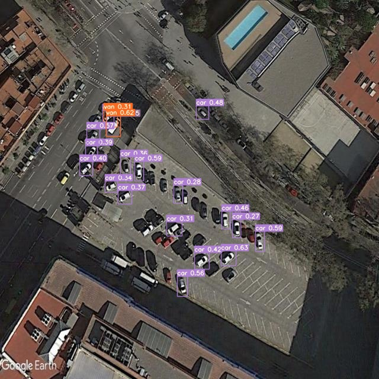

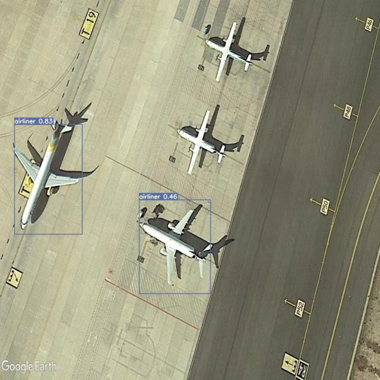

### F1-Score Confidence Curve

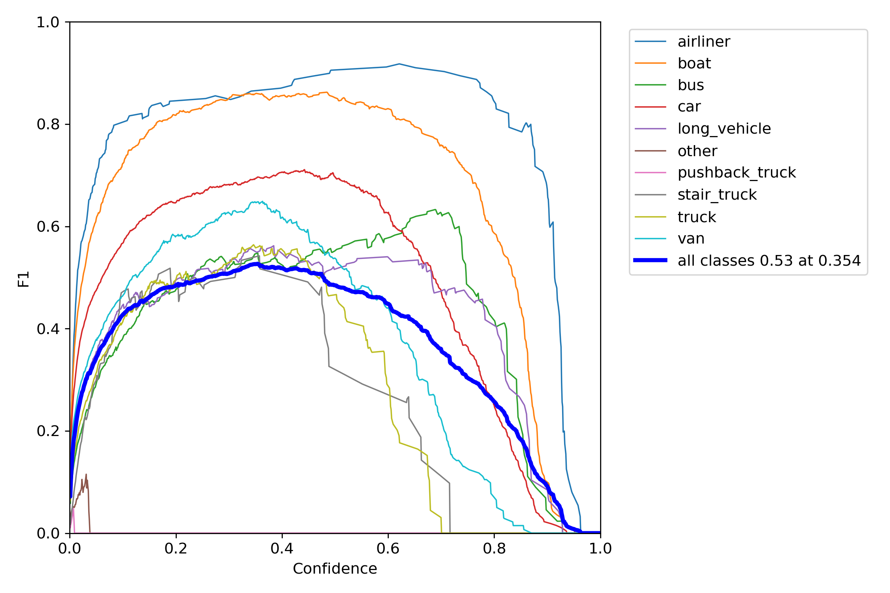

### Precision-Confidence Curve

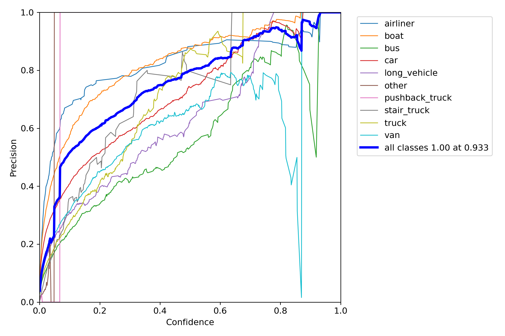

### Precision-Recall Curve

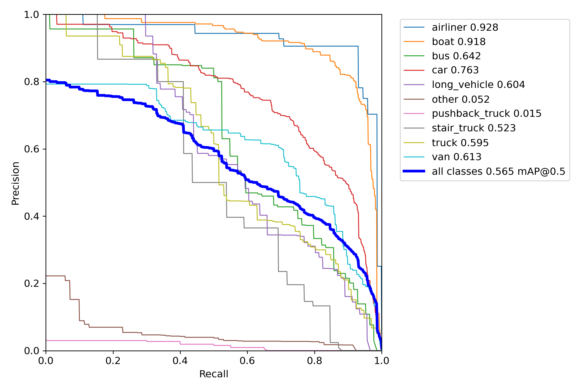

### Recall-Confidence Curve

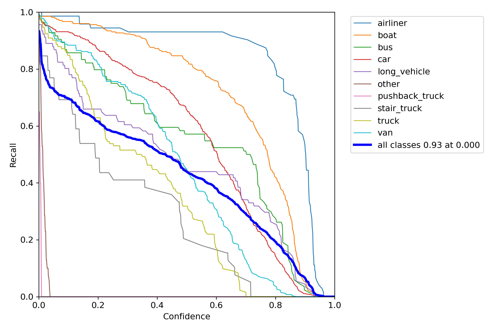

### Training and Validation Results

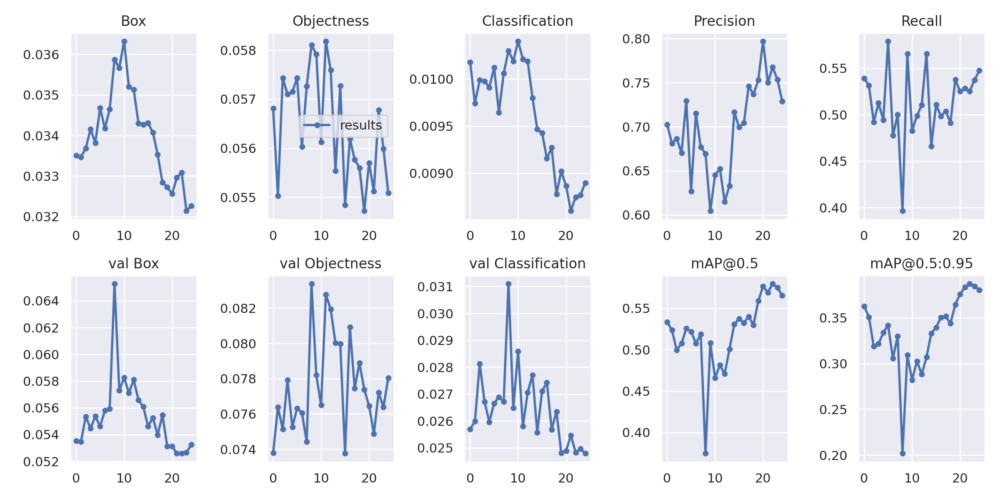

### Confusion Matrix

---

## Observations

### Strengths

1. **High Performance on Common Classes:**

   - The model achieves high precision and recall for classes like "airliner" (P: 0.809, R: 0.931) and "boat" (P: 0.816, R: 0.908).
   - The mAP@0.5 scores for frequent classes like "airliner" (0.928) and "boat" (0.918) are among the best.

2. **Effective Detection of Cars:**

   - The "car" class demonstrates solid precision (0.634), recall (0.772), and mAP@0.5:0.95 (0.496).

3. **Balanced Performance Across Frequent Classes:**
   - Classes like "truck" and "van" have consistent results with good precision, recall, and mAP scores.

### Weaknesses

1. **Challenges with Rare Classes:**

   - The "pushback truck" and "other" classes have precision values of 1.000 but recall values of 0.000, resulting in very low mAP scores (0.0152 and 0.0523, respectively).

2. **Moderate Performance for Stair Trucks:**

   - The "stair truck" class shows decent precision (0.797) but has lower recall (0.410), leading to suboptimal mAP@0.5:0.95 (0.303).

3. **Lower Recall Across Classes:**
   - Recall values across many classes remain below 0.60, suggesting room for improvement in identifying objects.

---

## Recommendations

1. **Dataset Augmentation:**

   - Include more samples of rare classes like "pushback truck" and "other" to improve recall and overall detection performance.

2. **Optimize Recall:**

   - Adjust training parameters or experiment with loss functions to enhance recall while maintaining precision.

3. **Fine-Tuning for Specific Classes:**
   - Perform targeted fine-tuning for classes like "stair truck" and "long vehicle" to achieve better balance between precision and recall.

---

## Conclusion

The YOLOv7-Transformer-HorNet-Attention model exhibits strong capabilities in detecting frequent object classes with high precision and recall. However, it struggles with rare classes, leading to lower overall mAP@0.5:0.95 (0.381). With further fine-tuning and dataset augmentation, the model's performance can be significantly enhanced.

---

# YOLOv7-MobileNet Model Analysis

---

## Model Summary

- **Model:** YOLOv7-MobileNet
- **Parameters:** 45,749,038
- **Layers:** 511

---

## Overall Metrics

| Metric            | Value |
| ----------------- | ----- |
| **Precision (P)** | 0.655 |
| **Recall (R)**    | 0.460 |
| **mAP@0.5**       | 0.483 |
| **mAP@0.5:0.95**  | 0.289 |

---

## Class-Wise Metrics

| Class              | Images | Labels | Precision (P) | Recall (R) | mAP@0.5 | mAP@0.5:0.95 |
| ------------------ | ------ | ------ | ------------- | ---------- | ------- | ------------ |
| **Airliner**       | 272    | 72     | 0.644         | 0.667      | 0.662   | 0.344        |
| **Boat**           | 272    | 274    | 0.632         | 0.909      | 0.880   | 0.508        |
| **Bus**            | 272    | 84     | 0.547         | 0.655      | 0.661   | 0.437        |
| **Car**            | 272    | 523    | 0.579         | 0.757      | 0.700   | 0.431        |
| **Long Vehicle**   | 272    | 91     | 0.580         | 0.395      | 0.481   | 0.252        |
| **Other**          | 272    | 70     | 1.000         | 0.000      | 0.054   | 0.032        |
| **Pushback Truck** | 272    | 20     | 1.000         | 0.000      | 0.025   | 0.013        |
| **Stair Truck**    | 272    | 39     | 0.466         | 0.157      | 0.312   | 0.154        |
| **Truck**          | 272    | 132    | 0.625         | 0.417      | 0.498   | 0.344        |
| **Van**            | 272    | 267    | 0.472         | 0.640      | 0.553   | 0.371        |

---

## Visualizations

### 2 Examples

### F1-Score Confidence Curve

### Precision-Confidence Curve

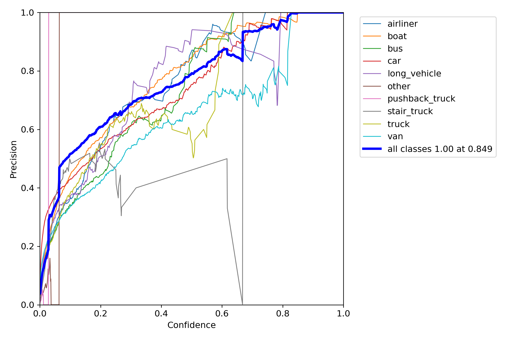

### Precision-Recall Curve

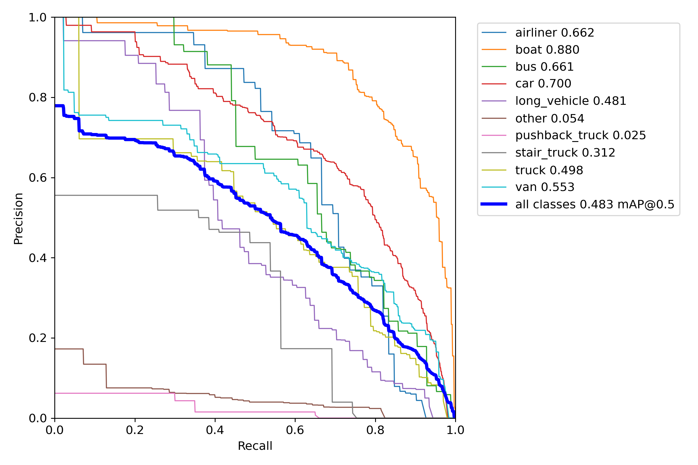

### Recall-Confidence Curve

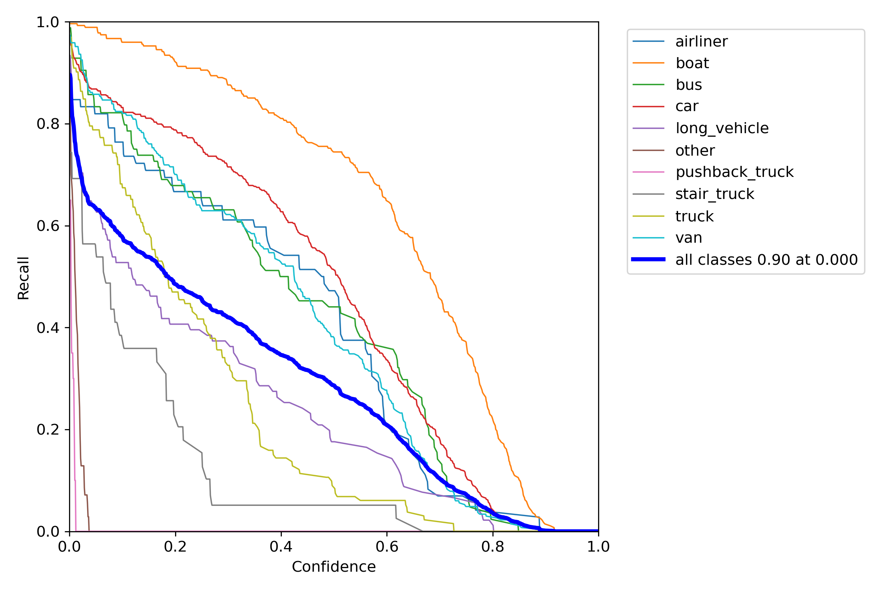

### Training and Validation Results

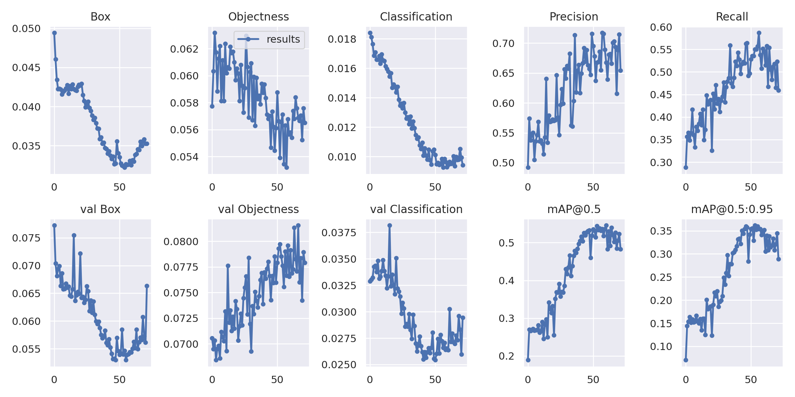

### Confusion Matrix

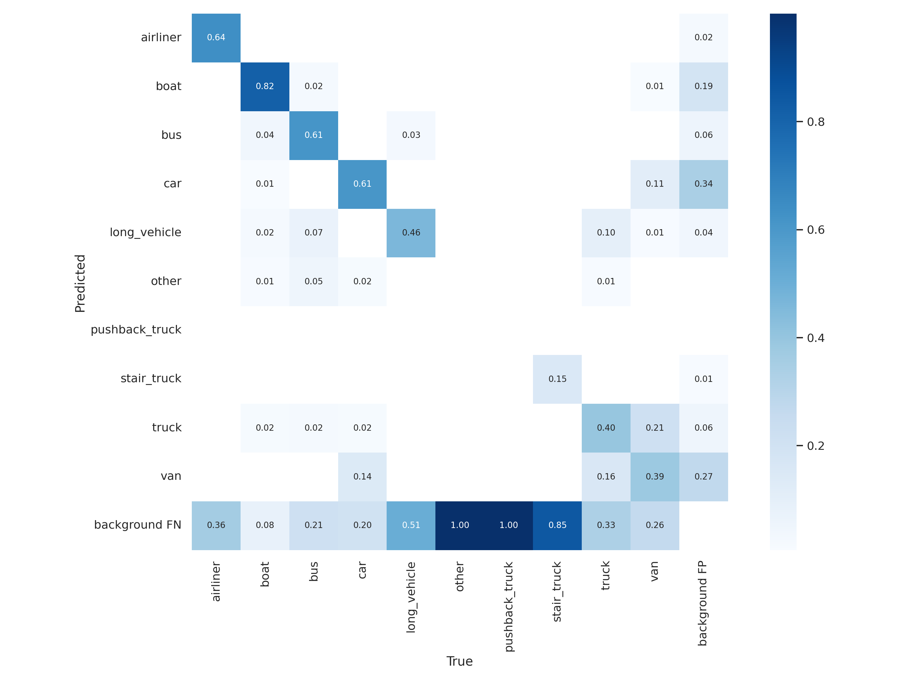

---

## Observations

### Strengths

1. **High Precision:** The model demonstrates excellent precision for "other" and "pushback truck" classes, suggesting minimal false positives.
2. **Boat Detection:** The "boat" class achieves a recall of 0.909 and mAP@0.5 of 0.880, indicating strong performance for this category.

### Weaknesses

1. **Rare Class Detection:** Similar to other models, rare classes like "other" and "pushback truck" suffer from zero recall, highlighting a failure to detect these objects.
2. **Stair Truck Recall:** The "stair truck" class has a very low recall (0.157), leading to missed detections despite moderate precision.

### Insights

- The **mAP@0.5** metric of 0.483 reflects moderate detection capabilities, while the **mAP@0.5:0.95** score of 0.289 suggests a decline in performance at stricter IoU thresholds.
- The model performs well for frequently occurring classes such as "boat," "airliner," and "car," while struggling with rarer or visually complex categories.

---

## Recommendations

1. **Focus on Rare Classes:** Augment the dataset for rare classes like "pushback truck" and "other" to improve recall.
2. **Model Fine-Tuning:** Adjust hyperparameters or loss weights to enhance sensitivity to underperforming categories.
3. **Balanced Dataset:** Ensure a more balanced dataset distribution to mitigate overfitting to frequent classes.

---

## Conclusion

The YOLOv7-MobileNet model provides reasonable detection capabilities for common object classes while exhibiting weaknesses in detecting rare classes. Future improvements should focus on addressing recall issues for underrepresented categories to achieve a more balanced performance across all object classes.

---

# YOLOv8 Ultralytics Model Analysis

---

## Model Summary

- **Model:** YOLOv8
- **Parameters:** 3,007,598
- **Layers:** 168
- **GFLOPs:** 8.1 (fused)

---

## Overall Metrics

| Metric            | Value |
| ----------------- | ----- |
| **Precision (P)** | 0.637 |
| **Recall (R)**    | 0.690 |
| **mAP@0.5**       | 0.692 |
| **mAP@0.5:0.95**  | 0.529 |

---

## Class-Wise Metrics

| Class              | Images | Instances | Precision (P) | Recall (R) | mAP@0.5 | mAP@0.5:0.95 |
| ------------------ | ------ | --------- | ------------- | ---------- | ------- | ------------ |
| **Airliner**       | 57     | 72        | 0.846         | 0.972      | 0.965   | 0.842        |
| **Boat**           | 21     | 274       | 0.725         | 0.956      | 0.910   | 0.651        |
| **Bus**            | 33     | 84        | 0.715         | 0.798      | 0.865   | 0.654        |
| **Car**            | 125    | 523       | 0.672         | 0.851      | 0.824   | 0.610        |
| **Long Vehicle**   | 30     | 91        | 0.695         | 0.753      | 0.759   | 0.587        |
| **Other**          | 38     | 70        | 0.250         | 0.186      | 0.150   | 0.113        |
| **Pushback Truck** | 16     | 20        | 0.621         | 0.250      | 0.280   | 0.204        |
| **Stair Truck**    | 28     | 39        | 0.602         | 0.718      | 0.706   | 0.465        |
| **Truck**          | 75     | 132       | 0.626         | 0.634      | 0.681   | 0.553        |
| **Van**            | 105    | 267       | 0.622         | 0.787      | 0.777   | 0.608        |

---

## Visualizations

### 2 Examples

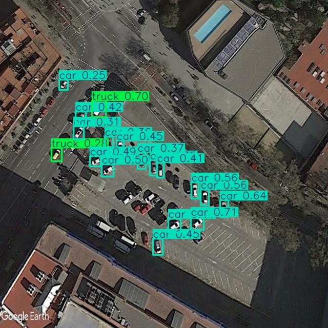

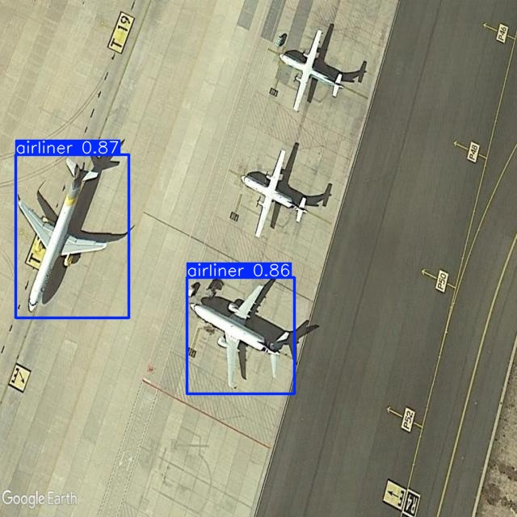

### F1-Score Confidence Curve

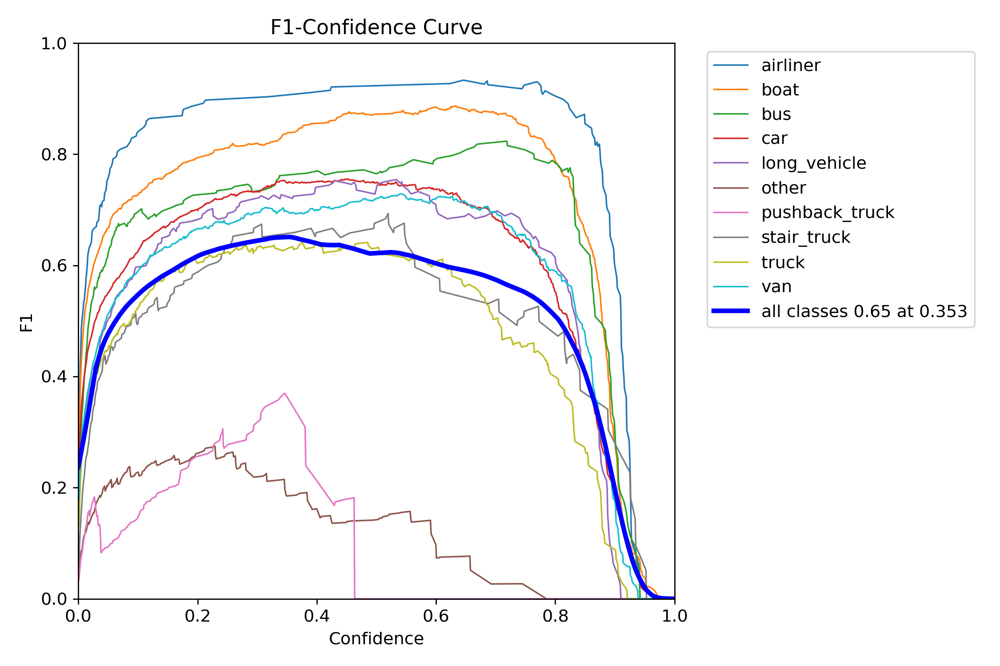

### Precision-Confidence Curve

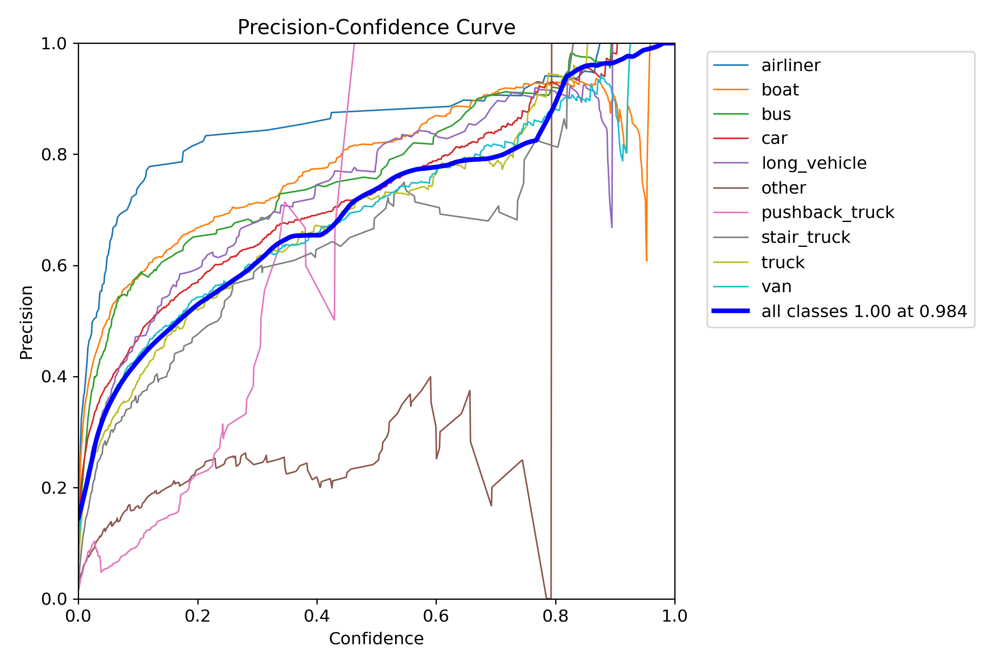

### Precision-Recall Curve

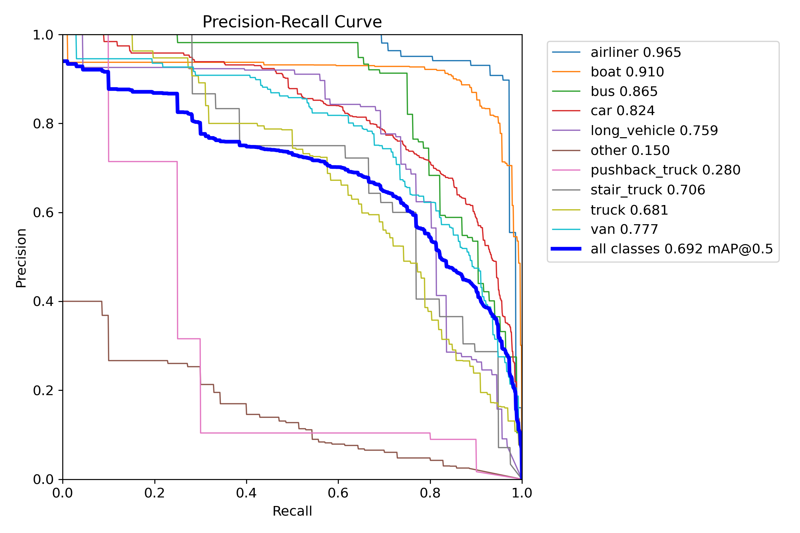

### Recall-Confidence Curve

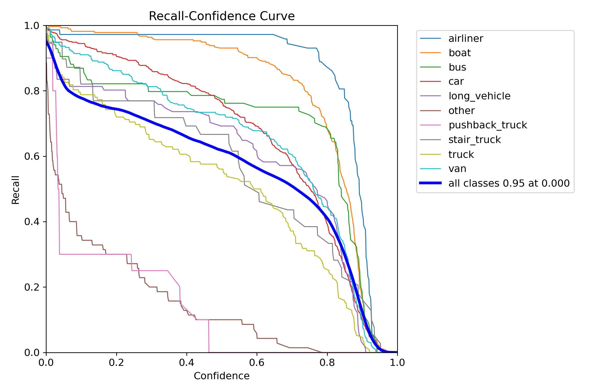

### Training and Validation Results

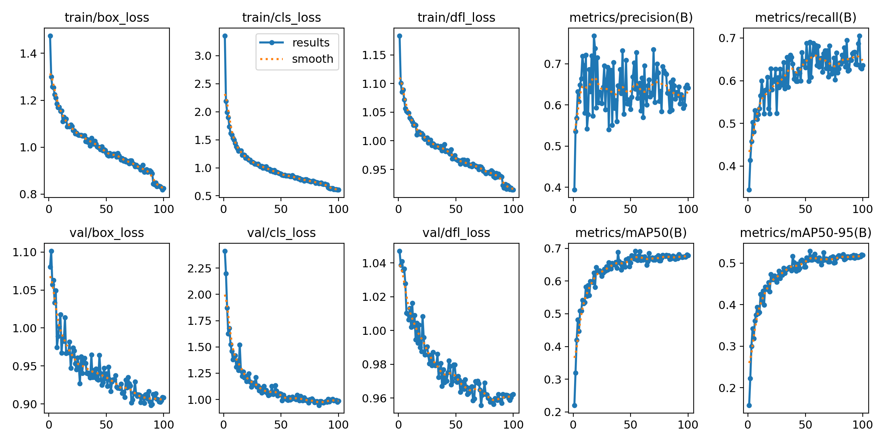

### Confusion Matrix

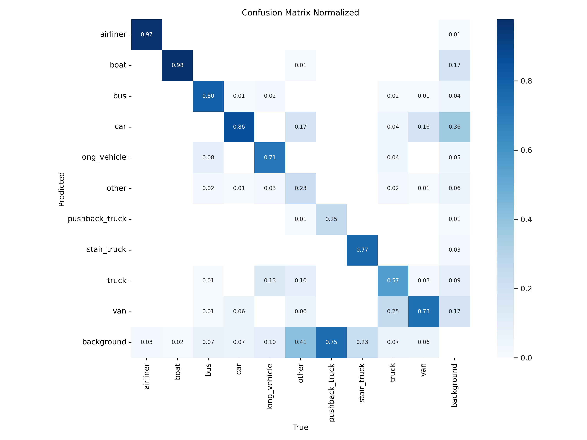

---

## Observations

### Strengths

1. **High Precision and Recall for Common Classes:**

   - Classes like "airliner," "boat," and "car" show excellent precision and recall, with mAP@0.5 values above 0.8.
   - The "boat" class achieves the highest recall (0.956) and strong overall mAP performance (mAP@0.5 of 0.910).

2. **Balanced Performance Across Classes:**
   - Frequent object classes such as "bus," "car," and "truck" maintain consistent detection accuracy with mAP@0.5:0.95 scores above 0.5.

### Weaknesses

1. **Rare Class Detection:**

   - Classes like "other" and "pushback truck" show poor performance with recall values as low as 0.186 and 0.250, respectively.
   - The "other" class struggles significantly, with a mAP@0.5:0.95 of only 0.113.

2. **Moderate mAP@0.5:0.95:**
   - While mAP@0.5 is strong at 0.692, the mAP@0.5:0.95 drops to 0.529, reflecting challenges in detecting objects at higher IoU thresholds.

### Insights

- The YOLOv8 model performs well for frequently occurring objects, especially in well-represented classes like "airliner," "boat," and "car."
- Improvements in dataset balance or model fine-tuning are required to address rare class detection issues.

---

## Recommendations

1. **Focus on Rare Classes:** Increase the representation of rare classes like "other" and "pushback truck" during training to improve their detection performance.
2. **Model Optimization:** Explore hyperparameter tuning or specialized training strategies for low-performing classes.
3. **Dataset Augmentation:** Implement data augmentation techniques to improve model generalization, especially for underrepresented classes.

---

## Conclusion

The YOLOv8 model showcases robust detection capabilities for frequent classes, with strong overall mAP@0.5 and recall values. However, improvements are necessary to enhance performance for rare and challenging classes, making it a balanced solution for object detection tasks with room for optimization.

---

# YOLOv9 Base Model Analysis

---

## Model Summary

- **Model:** YOLOv9 Base
- **Parameters:** 50,719,068
- **Layers:** 604
- **GFLOPs:** 236.7

---

## Overall Metrics

| Metric            | Value |
| ----------------- | ----- |
| **Precision (P)** | 0.682 |
| **Recall (R)**    | 0.550 |
| **mAP@0.5**       | 0.678 |
| **mAP@0.5:0.95**  | 0.516 |

---

## Class-Wise Metrics

| Class              | Images | Instances | Precision (P) | Recall (R) | mAP@0.5 | mAP@0.5:0.95 |
| ------------------ | ------ | --------- | ------------- | ---------- | ------- | ------------ |
| **Airliner**       | 272    | 72        | 0.851         | 0.972      | 0.973   | 0.869        |
| **Boat**           | 272    | 274       | 0.940         | 0.689      | 0.901   | 0.648        |
| **Bus**            | 272    | 84        | 0.839         | 0.714      | 0.881   | 0.684        |
| **Car**            | 272    | 523       | 0.823         | 0.687      | 0.839   | 0.618        |
| **Long Vehicle**   | 272    | 91        | 0.709         | 0.637      | 0.745   | 0.559        |
| **Other**          | 272    | 70        | 0.000         | 0.000      | 0.072   | 0.052        |
| **Pushback Truck** | 272    | 20        | 0.477         | 0.100      | 0.304   | 0.210        |
| **Stair Truck**    | 272    | 39        | 0.657         | 0.410      | 0.544   | 0.318        |
| **Truck**          | 272    | 132       | 0.739         | 0.667      | 0.742   | 0.587        |
| **Van**            | 272    | 267       | 0.787         | 0.625      | 0.781   | 0.618        |

---

## Visualizations

### 2 Examples

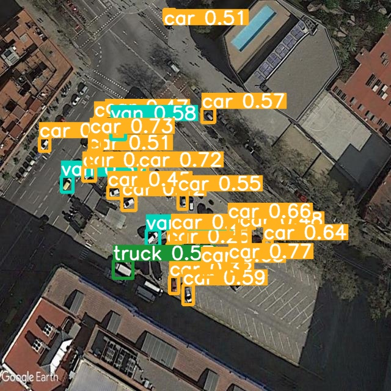

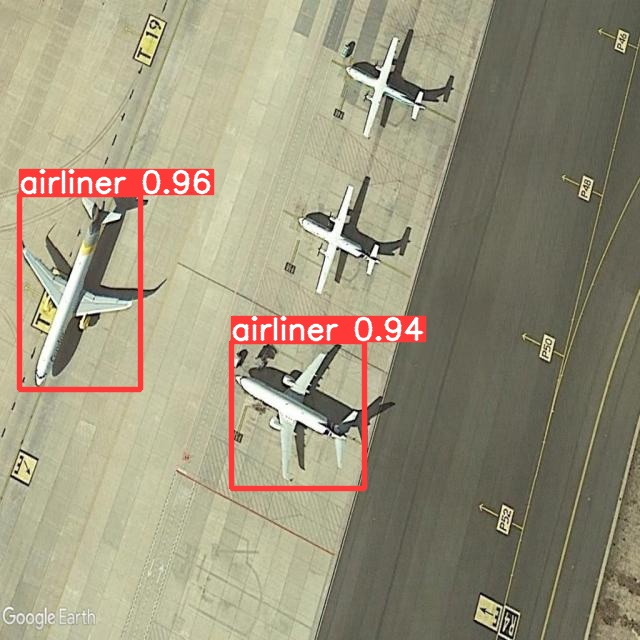

### F1-Score Curve

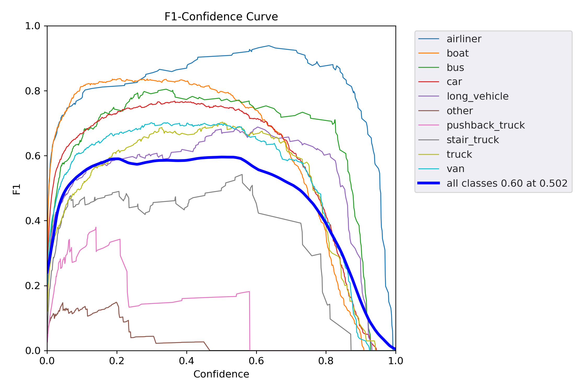

### Precision-Confidence Curve

### Precision-Recall Curve

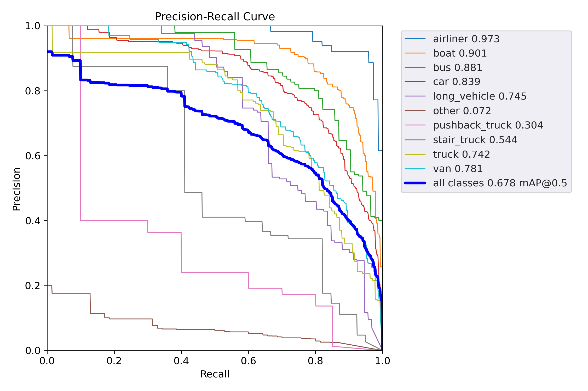

### Recall-Confidence Curve

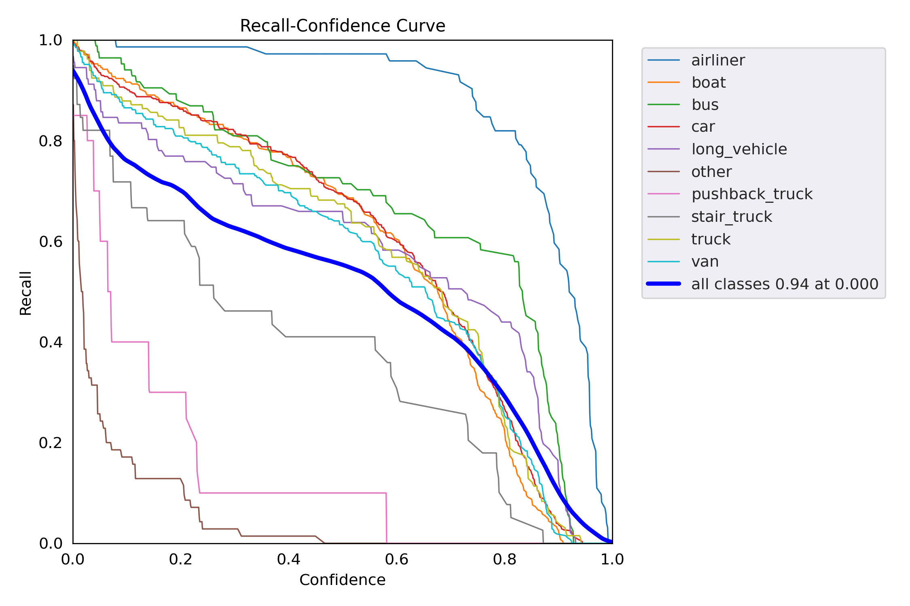

### Training and Validation Results

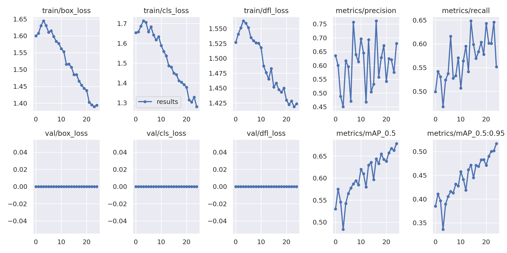

### Confusion Matrix

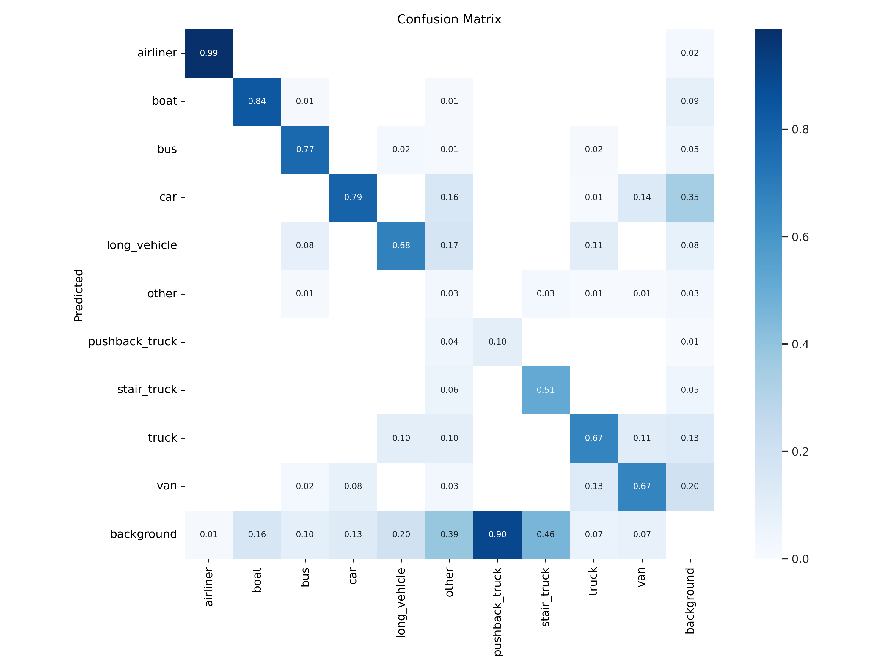

---

## Observations

### Strengths

1. **High Precision for Frequent Classes:**

   - Classes like "airliner," "boat," and "bus" exhibit excellent precision and recall, with mAP@0.5 values above 0.9.
   - The "airliner" class achieves the highest mAP@0.5:0.95 score at 0.869.

2. **Consistent Performance Across Key Classes:**
   - Classes like "car," "truck," and "van" maintain balanced precision, recall, and mAP values, demonstrating reliability in frequent object detection.

### Weaknesses

1. **Struggles with Rare Classes:**

   - The "other" class has zero precision and recall, with minimal mAP scores (mAP@0.5:0.95 of 0.052).
   - "Pushback truck" shows limited detection capability with a recall of 0.100 and mAP@0.5:0.95 of 0.210.

2. **Moderate Overall Recall:**
   - While precision is strong at 0.682, the overall recall lags at 0.550, indicating room for improvement in identifying more objects correctly.

### Insights

- The YOLOv9 base model excels in detecting frequent objects but underperforms for rare or complex objects.
- Fine-tuning or dataset augmentation is required to improve the performance of underrepresented classes.

---

## Recommendations

1. **Focus on Rare Classes:**
   - Increase training data for rare classes like "other" and "pushback truck" to enhance recall and precision.
2. **Data Augmentation:**
   - Employ data augmentation techniques to improve the generalization of the model for all classes.
3. **Hyperparameter Optimization:**
   - Fine-tune the model's hyperparameters to improve its recall while maintaining precision.

---

## Conclusion

The YOLOv9 base model delivers robust performance for frequent object classes, achieving high precision and mAP values. However, further enhancements are needed to address the challenges in detecting rare and complex classes. This makes it a versatile yet improvable solution for object detection tasks.

---
